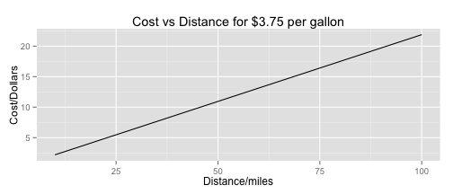

## How much for my classic car to grace a rally?

+ Do you own a Pontiac Firebird, Porsche 914-2 or other classic car?
+ Or another classic from the 70s, but no reliable MPG figures?
+ No Problem!
+ My app uses a regression fit on measured MPG figures from the 70s
+ Just enter horsepower and transmission type and the app does the rest
+ Get MPG value and a graph of cost against distance

---

## The app in action
Results are for a car with 250 HP and manual transmission

```
## [1] "Predicted MPG is  17.14"
```




---

## The science
+ The model was fitted by a super duper advanced degree holder doing super complicated math
+ Use _two_ whole predictors: horespower and type of transmission
+ This was based off work done in the regression models class
+ Lots of variables in the data set are highly correlated
+ It stands to reason for example that the displacement of the engine, number of cylinders, horsepower and quarter mile times are all closely linked

---

## Profitability Strategy for app
+ App does something useful!
+ Certainly more info than a single 'Yo'
+ Key seems to be "Make it Social"

---
## Further work, or as they say in the 'valley' Possible Pivots
+ It would also be useful to use the data set to predict quarter mile times using horsepower and weight as predictors
+ As always, with all statistics : Get More Data


